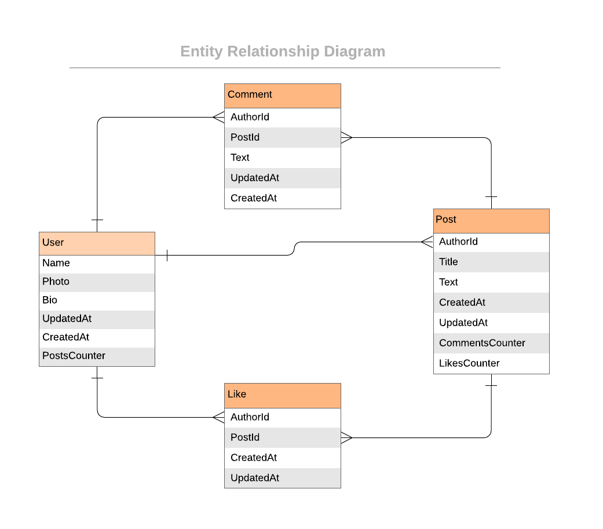

# Project Name: Ruby on Rails Blog App Project

## Project description:
The Blog app is a classic example of a blog website that shows the list of posts and empower readers to interact with them by adding comments and liking posts.

## Project Requirements:
Create the entities presented in this diagram:

The app must be built according to following wireframes:

- Project to be developed according to the following phases:

Project 1: Creating a data model.

Project 2: Validations and Model specs.

Project 3: Processing data in models.

Project 4: Setup and controllers.

Project 5: Controllers specs.

Project 6: Views.

Project 7: Forms.

Project 8: Integration specs for Views and fixing n+1 problems.

Project 9: Add Devise.

Project 10: Add authorization rules.

Project 11: Add API endpoints.

Exercise: API documentation.

## Getting Started

Get a local copy by clonning this repo.

To run the code please use the "Code Runner" VSCode extension or
ruby main.rb in the terminal.

## Built With:
Major languages: HTML, CSS, JavaScript, Ruby, Postgresql, Ruby on Rails
Technologies used: VSC, Github, Gitflow, RSpec

## Video presentation:

Please click the following link to watch the video presentation

##  Authors
👤 Author1

Dario Alessio

GitHub: https://github.com/DarioAlessioR

Slack: https://microverse-students.slack.com/team/U039GCFRK9B

LinkedIn: https://www.linkedin.com/in/dario-alessio-3a3b7911b

## 🤝 Contributing:

Contributions, issues, and feature requests are welcome!

Feel free to check the [issues page](../../issues/).

## Show your support:

Give a ⭐️ if you like this project!

## Acknowledgments

- Hat tip to anyone whose code was used
- Inspiration
- etc

## 📝 License

This project is [MIT](./LICENSE.md) licensed.